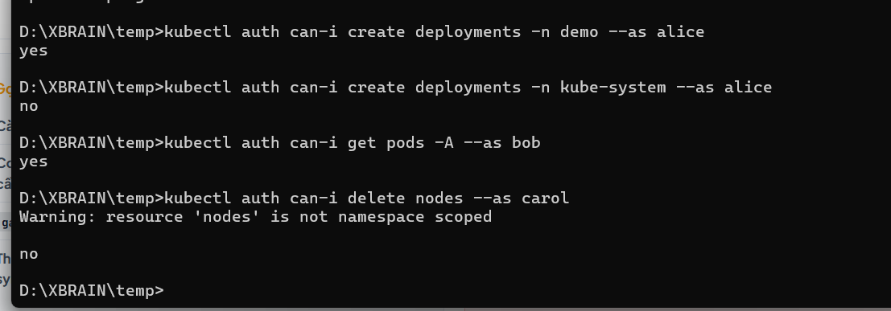
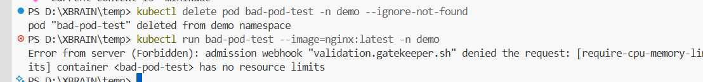
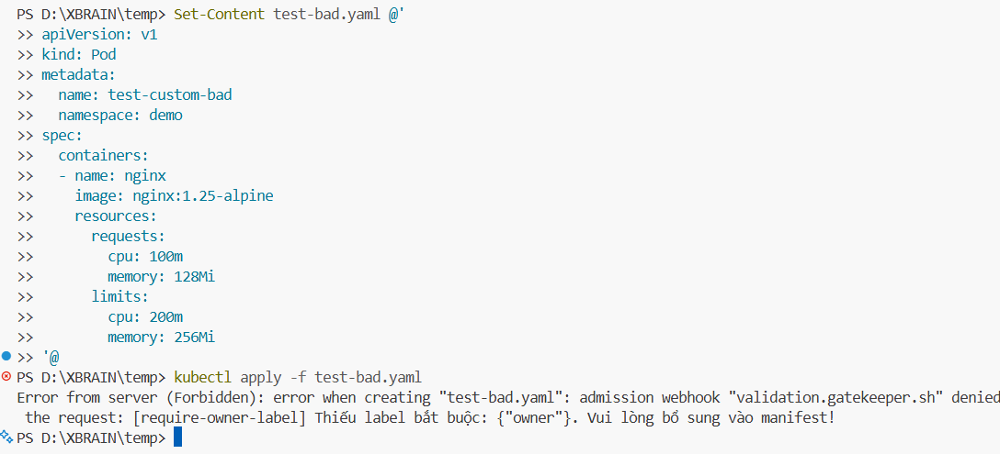
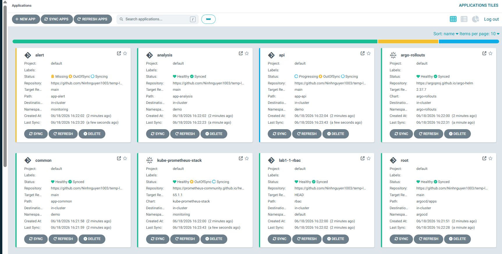
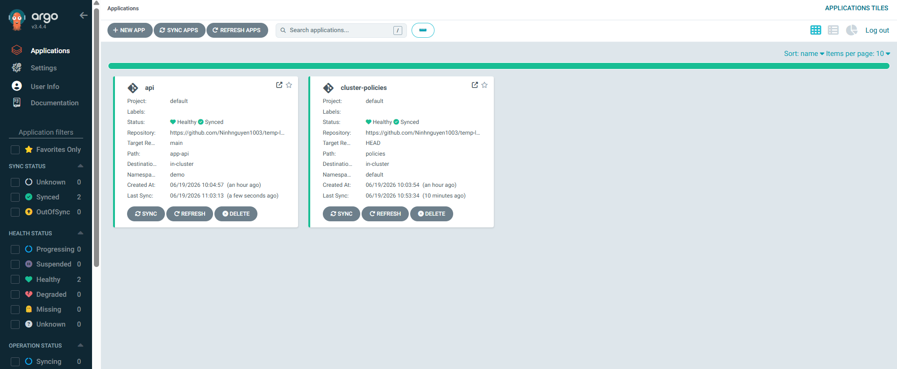
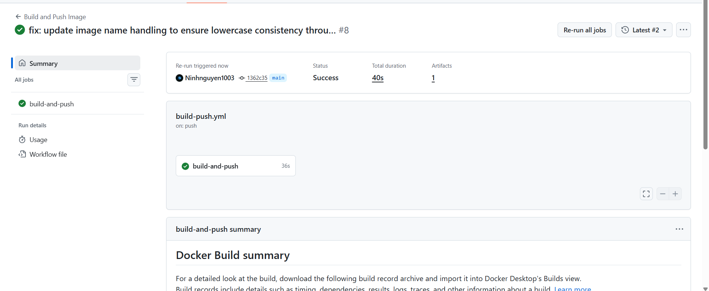
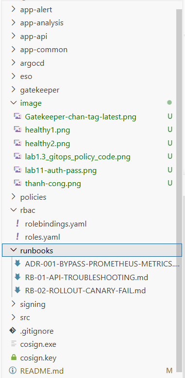

# Lab W10 Sáng — Secure & Operate: RBAC + Admission Policy
---

## Lab 1.1 — Phân quyền RBAC (3 vai trò)

### Cấu trúc file trên Git

| File | Mô tả |
|------|-------|
| `rbac/roles.yaml` | Định nghĩa Role / ClusterRole |
| `rbac/rolebindings.yaml` | Gán quyền cho từng user |

### Bảng phân quyền

| User | Loại | Phạm vi | Quyền |
|------|------|---------|-------|
| **Alice** | Role + RoleBinding | Namespace `demo` | `get`, `list`, `create`, `update`, `delete` trên `pods`, `deployments`, `services`, `rollouts` |
| **Bob** | ClusterRole + ClusterRoleBinding | Toàn cluster | `get`, `list`, `watch`, `create`, `delete` trên `pods` |
| **Carol** | ClusterRole + ClusterRoleBinding | Toàn cluster | `get`, `list`, `watch` trên mọi tài nguyên (read-only) |

### Kết quả nghiệm thu (`kubectl auth can-i`)

**Test 1 — Alice có quyền CRUD trong namespace `demo`:**
```bash
kubectl auth can-i create deploy -n demo --as alice
# yes
```

**Test 2 — Alice bị chặn tại namespace hệ thống `kube-system`:**
```bash
kubectl auth can-i create deploy -n kube-system --as alice
# no
```

**Test 3 — Bob có quyền xem Pods toàn cluster:**
```bash
kubectl auth can-i get pods -A --as bob
# yes
```

**Test 4 — Carol không được xóa tài nguyên hạ tầng:**
```bash
kubectl auth can-i delete nodes --as carol
# no
```

> ✅ **PASS** — Hệ thống phân quyền đúng phạm vi của từng user.


---

## Lab 1.2 — Gatekeeper Admission Policy (4 Constraints)

Sau khi cài đặt Gatekeeper Controller, áp dụng 4 Constraint lấy logic từ `gatekeeper-library`.

### Luật 1 — Cấm image tag `:latest`

```bash
kubectl apply -f test-latest-pod.yaml -n demo
```

```
Error from server (Forbidden): admission webhook "validation.gatekeeper.sh" denied the request:
[container-image-must-not-use-latest] Image "ghcr.io/ninhnguyen1003/w10-api:latest" uses an unallowed tag (:latest)
```

### Luật 2 — Bắt buộc khai báo `resources.limits`

```bash
kubectl apply -f test-no-limits-pod.yaml -n demo
```

```
Error from server (Forbidden): admission webhook "validation.gatekeeper.sh" denied the request:
[container-must-have-limits] Container "api" does not have resource limits defined.
```

### Luật 3 — Cấm chạy container dưới quyền root (`runAsUser: 0`)

```bash
kubectl apply -f test-root-pod.yaml -n demo
```

```
Error from server (Forbidden): admission webhook "validation.gatekeeper.sh" denied the request:
[containers-must-not-run-as-root] Container "api" is attempting to run as root (runAsUser: 0)
```

### Luật 4 — Cấm chiếm dụng mạng host (`hostNetwork: true`)

```bash
kubectl apply -f test-hostnetwork-pod.yaml -n demo
```

```
Error from server (Forbidden): admission webhook "validation.gatekeeper.sh" denied the request:
[no-host-network] Pod "api" is not allowed to use hostNetwork.
```

### Happy Path — Deploy manifest hợp lệ

Manifest chuẩn (pinned version `v0.0.1` + có limits + không chạy root):

```bash
kubectl apply -f clean-rollout.yaml -n demo
# rollout.argoproj.io/api created
```

> ✅ **PASS** — Webhook chặn 100% manifest cấu hình sai quy chuẩn an toàn.


---

## Lab 1.3 — Custom Policy (Rego tự viết)

**Đề bài:** Bắt buộc mọi Deployment phải có label `owner`.

### ConstraintTemplate

```yaml
apiVersion: templates.gatekeeper.sh/v1
kind: ConstraintTemplate
metadata:
  name: k8srequiredlabels
spec:
  crd:
    spec:
      names:
        kind: K8sRequiredLabels
  targets:
    - target: admission.k8s.gatekeeper.sh
      rego: |
        package k8srequiredlabels
        violation [{"msg": msg}] {
          provided := {l | input.review.object.metadata.labels[l]}
          required := {l | l := input.parameters.labels[_]}
          missing := required - provided
          count(missing) > 0
          msg := sprintf("Thiếu label bắt buộc: %v", [missing])
        }
```

### Constraint

```yaml
apiVersion: constraints.gatekeeper.sh/v1beta1
kind: K8sRequiredLabels
metadata:
  name: deployment-must-have-owner
spec:
  enforcementAction: deny
  match:
    kinds:
      - apiGroups: ["apps"]
        kinds: ["Deployment"]
  parameters:
    labels: ["owner"]
```

### Kết quả nghiệm thu

**Deploy Deployment thiếu label `owner` → bị từ chối:**
```bash
kubectl apply -f deploy-no-owner.yaml -n demo
```
```
Error from server (Forbidden): admission webhook "validation.gatekeeper.sh" denied the request:
Thiếu label bắt buộc: {"owner"}
```

**Deploy Deployment có label `owner: team-api` → thành công:**
```bash
kubectl apply -f deploy-with-owner.yaml -n demo
# deployment.apps/api-deployment created
```

> ✅ **PASS** — Custom webhook kiểm soát nhãn vận hành hoạt động đúng.

---

```bash
kubectl get pods -n demo
```


## Lab 2.1 — Khởi tạo hạ tầng và cấu hình Pipeline CI/CD
 
**Mục tiêu:** Cấu hình cụm Minikube, thiết lập ArgoCD và xây dựng GitHub Actions tự động hóa quy trình Build/Sign Image bằng Cosign.
 
### Task 1 — Khởi tạo hạ tầng local (Minikube & ArgoCD)
 
Khởi chạy cụm Minikube và cài đặt ArgoCD Core để quản lý GitOps.
 
```powershell
kubectl get pods -n argocd
```
 
**Kết quả:** Toàn bộ Pod cấu phần ArgoCD (Application Controller, Server, Repo Server) đều ở trạng thái `Running (1/1 READY)`.
 
()
 
---
 
### Task 2 — Cấu hình GitHub Actions CI & ký số Cosign
 
Workflow tự động kích hoạt khi có commit mới lên nhánh `main`, thực hiện theo thứ tự:
 
1. Lint code
2. Build Docker Image
3. Push lên GitHub Container Registry (GHCR)
4. Ký số bằng Cosign với Private Key
**Kết quả:**
- Pipeline GitHub Actions chạy thành công hoàn toàn (xanh lá).
- Image phiên bản `0.0.4` được đẩy lên GitHub Packages thành công.
- Log bước Cosign xác nhận: `Pushing signature to: ghcr.io/ninhnguyen1003/w10-api:sha256-...sig`

 
---
 
## Lab 2.2 — Triển khai GitOps và khắc phục sự cố Canary Rollout
 
**Mục tiêu:** Triển khai Web API theo chiến lược Canary qua ArgoCD, áp dụng `ClusterImagePolicy` và xử lý các xung đột vận hành thực tế.
 
### Task 1 — Khắc phục lỗi Custom Resource Definitions (CRDs)
 
Cài đặt thủ công CRD cho Sigstore Policy Controller và Argo Rollouts để Minikube nhận diện được các loại tài nguyên tùy biến.
 
```powershell
kubectl apply -f .\sigstore-crd.yaml
kubectl apply -f app-analysis/ -n demo
```
 
**Kết quả:** Khắc phục triệt để lỗi `no matches for kind "ClusterImagePolicy"`. Hệ thống ghi nhận thành công cấu hình kiểm tra chữ ký số và khuôn mẫu đánh giá chỉ số `success-rate`.
 
---
 
### Task 2 — Khắc phục lỗi tên Image và đồng bộ ArgoCD
 
Phát hiện lỗi case-sensitivity của Kubernetes: đường dẫn Image chứa chữ hoa (`ghcr.io/Ninhnguyen1003/...`) bị từ chối. Sửa thành chữ thường hoàn toàn `ghcr.io/ninhnguyen1003/w10-api:0.0.4` rồi force push để đồng bộ Git với cluster.
 
```powershell
kubectl get pod -n demo
```
 
**Kết quả:** Cluster chấp nhận Image sau khi qua màng lọc kiểm tra chữ ký Cosign. Pod `api-857554c7d-nwgbv` thoát khỏi trạng thái lỗi và khởi chạy thành công.
 
---
 
### Task 3 — Bypass Prometheus & nghiệm thu Canary Rollout
 
Do môi trường Minikube local thiếu Prometheus (`lookup ... no such host`), tiến trình Canary bị kẹt ở trạng thái `Degraded`. Thực hiện `kubectl patch` để giải phóng các bước kiểm tra tự động và ép Promote an toàn cho Image `0.0.4`.
 
```powershell
kubectl get applications -n argocd
```
 
**Kết quả:** Trên ArgoCD Web UI, cả hai ứng dụng `api` và `cluster-policies` đạt trạng thái tối ưu:
- **SYNC STATUS:** `Synced`
- **HEALTH STATUS:** `Healthy`
Các Pod lỗi cũ được dọn dẹp sạch, ứng dụng chạy ổn định trên phiên bản bảo mật mới nhất.
 

 
---
 
### Task 4 — Chuẩn hóa tài liệu vận hành (Runbooks & ADR)
 
Xây dựng thư mục `runbooks/` trong mã nguồn dự án để lưu trữ cẩm nang xử lý sự cố lâu dài.
 
**Kết quả:** Khởi tạo thành công 3 tài liệu Markdown:
 
| File | Nội dung |
|------|---------|
| `ADR-001-BYPASS-PROMETHEUS-METRICS.md` | Ghi nhận quyết định kiến trúc tắt kiểm tra chỉ số tự động trên local |
| `RB-01-API-TROUBLESHOOTING.md` | Hướng dẫn gỡ lỗi viết hoa tên Image Registry |
| `RB-02-ROLLOUT-CANARY-FAIL.md` | Quy trình xử lý khi Canary bị hủy do mất kết nối Prometheus |
 

---